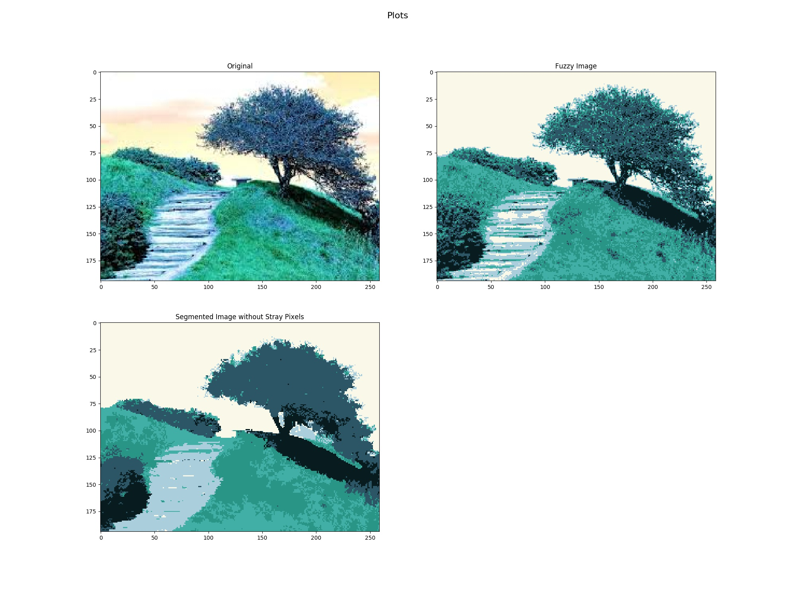
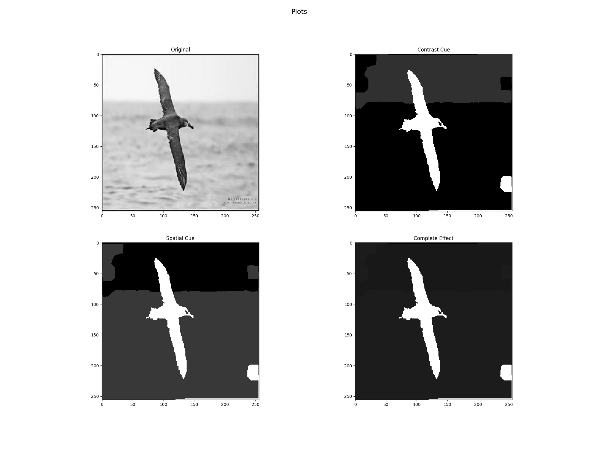

# :pushpin: Computer Vision : Fuzzy C-Means & SLIC

There are two tasks implemented in this exercise:

1. Implemented a region segmentation algorithm using the fuzzy c-means algorithm on normalized 'RGBxy' data of an image and merged stray (isolated) pixels (or very-small-regions) to their surrounding regions.

2. Obtained the spatial and contrast cues of the image using SLIC superpixels instead of pixels. Implemented the separation measure to obtain quality scores for the two cues obtained. Used these quality scores as weights while performing the weighted sum of the two cues for getting the final saliency cue.

## :technologist: Requirements

:package: numpy  
:package: skfuzzy  
:package: skimage  
:package: sklearn  
:package: scipy  
:package: cv2  
:package: matplotlib

## :card_file_box: Files
* 'Report.pdf': Contains the complete report for the exercise. 
* 'codeforQ1.py' : Contains the code for using fuzzy c-means/first question of the exercise. 
* 'codeforQ2andQ3.ipynb' : Contains the code for using SLIC and getting the final saliency cue/second and third question of the exercise. 
* 'q1img.jpeg' & 'q2&3bird.jpg' - input images

## :monocle_face: Results

**First Part**  
 

* Ran the fuzzy cmeans algorithm with cluster size predefined (say 6) on the image to cluster the image on the basis of the colors.
* The image was iterated and a dfs algorithm is used to find the size of the islands on the segmented image. Dfs algorithm also stores the boundary pixels to that connected component (color) in the boundary dictionary.
* If the size of the island (of pixels) is smaller than the threshold then its color is replaced with the majority color in the boundary pixels using the boundary dictionary .

**Second Part**  

* Performed slic on the image and obtained the superpixels.
* Computed the coordinates and color of superpixels by averaging the pixels in it.
* Performed k means (clustering algorithm) on the color of superpixels (kmeans runs for variable clusters at start and chooses the best cluster hyperparameter on its own).
* Calculated the contrast and spatial que of the image
* Found separation measure (phi values) using the matrix of contrast que and then spatial que.
* Ran Otsu threshold on the normalised matrix to find foreground and background.
* Calculated the phi values using the separation measure formula implemented from the paper.
* The final image was formed by combining the contrast and spatial matrix using the phi values as weights. Normalised the matrix and multiply by 255.

More detailed analysis can be found in the Report.pdf

## Acknowledgments
This exercise was a part of Computer Vision course.

:star: Have you found this repository helpful? Give it a star to show your support! :star:

